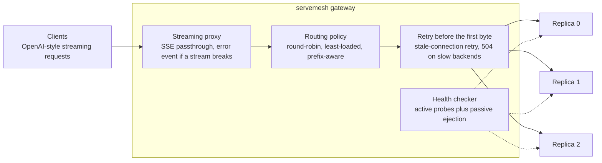

# servemesh

[](https://github.com/pandeylakshya207-max/servemesh/actions/workflows/ci.yml)

A cache-aware, fault-tolerant gateway for LLM serving, written in Go. It sits in front of several model replicas, exposes an OpenAI-style streaming API, and decides which replica serves each request.

## Architecture



How a request flows: the gateway reads the prompt, the routing policy picks a replica (the pick and the slot reservation are one atomic step), and the response is streamed back as it arrives. If a replica cannot be reached before the first byte, the request is retried on a different replica; if a replica fails after the first byte, the client receives an explicit error event instead of a silently truncated stream. A replica that is slow but alive gets a 504 and is not ejected, because retrying onto an overloaded cluster adds load. Health checks run in the background and eject or restore replicas.
## Features

- Streaming reverse proxy for `/v1/chat/completions` (SSE).
- Pluggable routing policies: round-robin, least-loaded, and prefix-aware (routes to the replica most likely to hold the prompt's prefix in its KV cache, with a bounded-load cap and a choice of cold-prefix placement).
- Active and passive health checking, retry on a different replica before the first byte, explicit error events when a stream fails midway, and a configurable response-header timeout that returns 504 for slow backends without ejecting them.
- A mock replica with a simulated prefix cache, an open-loop (Poisson) benchmark harness, and a sequential replay tool that reads real cache counters from llama.cpp.

## Results

**Real engine (llama.cpp, Qwen2.5-0.5B, 3 CPU replicas, sequential client, 5 seeds):** prefix-aware routing raised the prefix-cache hit rate from about 71.5% to 78.8% on every paired seed, cut prompt tokens prefilled by 26%, and cut p95 time-to-first-token by 71% (cold requests fell from 10.5% to 1.1%). Median TTFT was unchanged. This is a modest, real gain with llama-server's default host-memory prompt cache; with that cache disabled the hit-rate gain was much larger (27.0% to 54.8%, 3 seeds).

**Simulation:** in a mock-replica simulator prefix-aware routing looked much stronger (hit rate from about 28% to 65-73%). That did not carry over to the real engine, whose cache retained far more than the simulator's did, so treat the simulated numbers as design exploration, not predictions.

A backend killed under load failed only the 3 of 400 requests already streaming from it (simulator).

Full tables, caveats and limitations: [docs/RESULTS.md](docs/RESULTS.md). Not yet tested: GPUs, vLLM, concurrent load on real replicas.

## Quick start

```powershell
go test ./...
go build -o bin/mockbackend.exe ./cmd/mockbackend
go build -o bin/gateway.exe ./cmd/gateway

.\bin\mockbackend.exe -id=m0 -addr=:9000
.\bin\mockbackend.exe -id=m1 -addr=:9001
.\bin\gateway.exe -policy=prefix-aware -cold-fallback=least-loaded -backends=m0=localhost:9000,m1=localhost:9001
```

For real llama-server replicas, add `-health-path=/health` and see `bench/replay-llama.ps1`.

## Run with Docker

    docker compose up -d --build     # gateway on :8080 in front of three mock replicas
    curl.exe http://localhost:8080/backends
    curl.exe http://localhost:8080/metrics
    docker compose down

CI builds both images on every push. Metrics are served at `/metrics` (request counts by backend and status, first-chunk latency, pick latency, per-backend in-flight and health).

## Kubernetes

`deploy/k8s/servemesh.yaml` runs three mock replicas as a StatefulSet and the gateway as a single-replica Deployment (its prefix tracker lives in the process, so more gateway replicas would not share state). The manifest has not been applied to a real cluster yet.
## Layout

- `internal/router`: routing policies
- `internal/proxy`: streaming gateway, health checks
- `internal/backend`: mock replica with a simulated prefix cache
- `cmd/bench`: open-loop load generator; `cmd/replay`: sequential replay against llama.cpp
- `bench/`: run, chaos, retry and llama scripts

## Status

Validated against a simulator and, at small scale, against real llama.cpp replicas. Planned: validation against vLLM on a GPU, a replicated (HA) gateway control plane.
